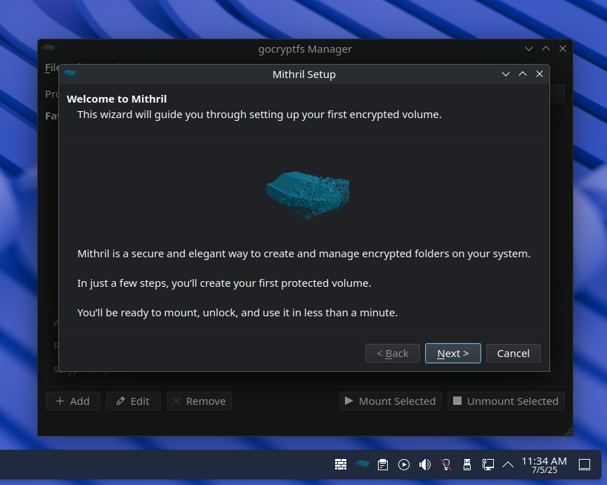

# Mithril

*A strong and valuable material that offers high quality lightweight protection.*

**Mithril** is a simple and elegant graphical interface for managing encrypted volumes with [gocryptfs](https://github.com/rfjakob/gocryptfs).

- Manage favorite encrypted folders
- Easily mount/unmount with custom flags
- Profile support for multiple configurations
- System tray integration for quick access
- Lightweight and secure

  

> *(This project is unrelated to Mithril.js.)*

Licensed under the MIT License.
